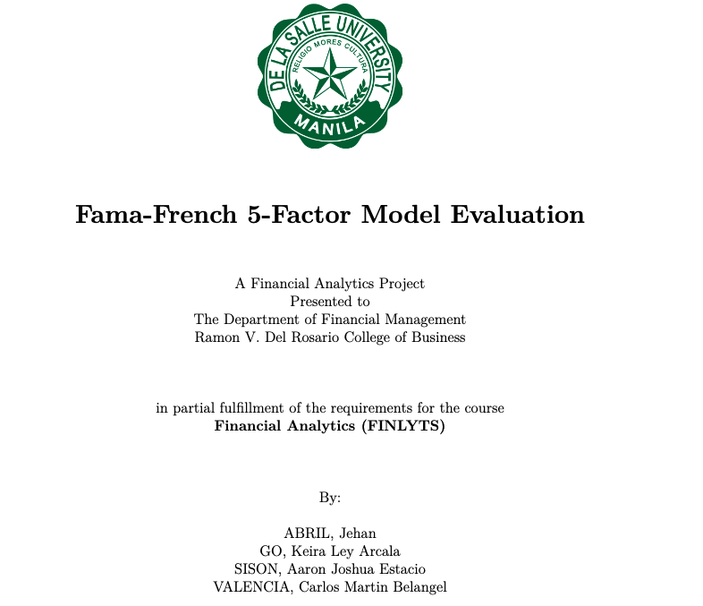
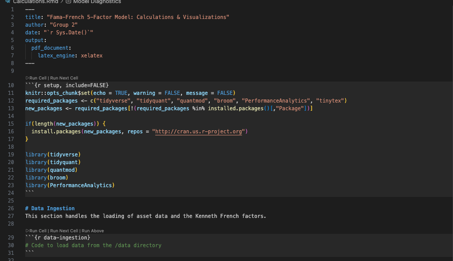
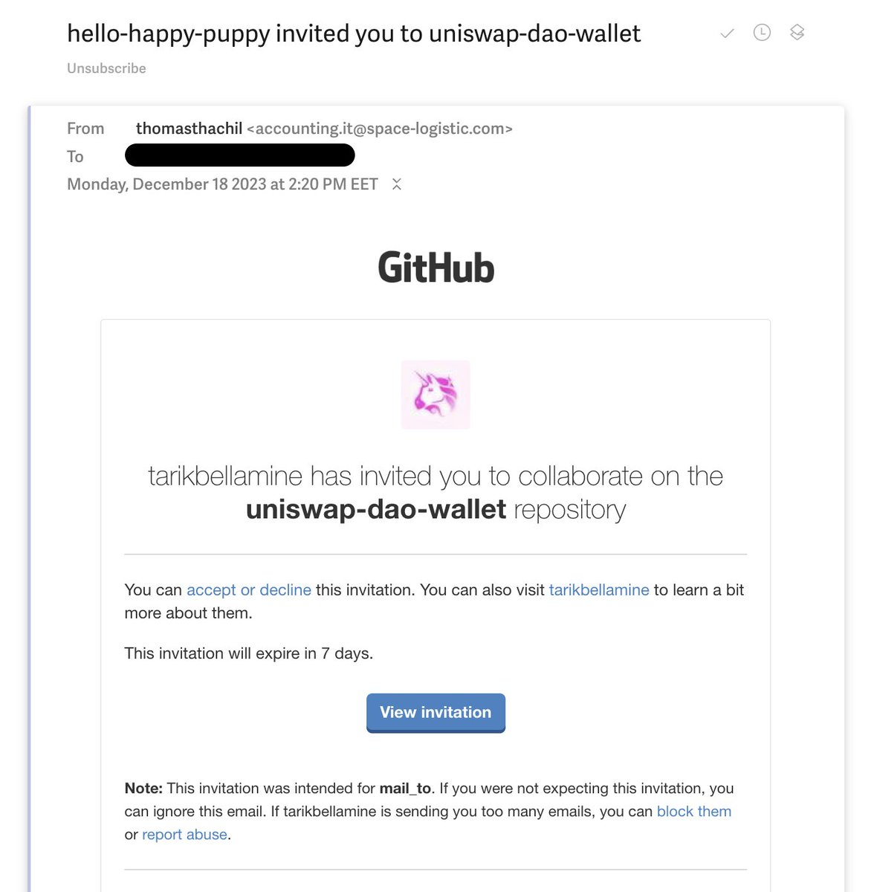
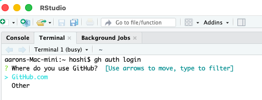
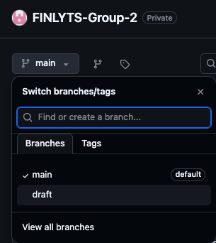

# Financial Analytics [FINLYTS CO2] 

> [!IMPORTANT]
> **View the live project on GitHub:** [sakudiff/FINLYTS-Group-2](https://github.com/sakudiff/FINLYTS-Group-2/blob/main/README.md)  
> *Note: You must be signed into a GitHub account with authorized access to view this private repository.*

## Fama-French 5-Factor Model Evaluation

### Group 2

---

## Quick Navigation
*   [**Project Overview**](#project-overview) - High-level goals and data sources.
*   [**Directory Map**](#directory-map) - Where to find specific files.
*   [**Research Outline**](#research-outline) - The 4-part academic structure.
*   [**GitHub & R Guide**](#github--r-guide) - Setup and workflow instructions (Start here for collaborators).
*   [**LaTeX Guide**](#8-working-with-latex-tex) - Instructions for editing the final paper.

---

## Project Overview
This project involves a rigorous evaluation of the **Fama-French 5-Factor Model** using R. The model extends the Capital Asset Pricing Model (CAPM) by incorporating Size, Value, Profitability, and Investment factors alongside standard market risk. The core objective is to determine the efficacy of these five factors in explaining the excess returns of a portfolio comprising eight selected assets.

- **Primary Data Source:** [Kenneth French Data Library (202412 Archive)](https://mba.tuck.dartmouth.edu/pages/faculty/ken.french/data_library_202412_archive.html?fbclid=IwY2xjawQQ7_VleHRuA2FlbQIxMABicmlkETFsSFNsRW9xUzFERHV0Mmphc3J0YwZhcHBfaWQQMjIyMDM5MTc4ODIwMDg5MgABHhCyNmhvsra8VKQbzTAyF44hmQnhpTS1HayGqPx4nJFkfgL3PNoSgsHpVOy3_aem_4hRBx0knAjCHkzPbw_raSQ)
- **Lecture Baseline:** [Financial Analytics CO2 Lecture](https://youtu.be/RPvvnNdwgBo?si=kGSzqJF13dZCSI0m)

## Objectives
- **Empirical Analysis:** Assess how well the five factors (Market, SMB, HML, RMW, CMA) explain asset returns.
- **Statistical Interpretation:** Analyze alpha and beta coefficients for statistical significance and economic meaning.
- **Technical Implementation:** Execute a reproducible R workflow utilizing the Kenneth French data library.
- **Theoretical Justification:** Provide academic grounding for asset selection and factor exposure.

## Final Deliverables (Point 7: Quality & Organization)
| Deliverable | Format/Description |
| :--- | :--- |
| **Reproducible Master Document** | Well-organized RMarkdown (.Rmd) file (HTML, PDF, or Word). |
| **Data Package** | CSV files containing historical asset data. |
| **Reference Management** | BibTeX (.bib) file for academic citations. |
| **Code Audit** | Full R code integrated into the narrative or technical appendix. |

## Directory Map

| Title & Link | Description | Purpose |
| :--- | :--- | :--- |
| [**data/**](data/) | Raw CSV files from Kenneth French & Yahoo Finance. | Source data for all quantitative models. |
| [**image/**](image/) | Plots, logos, and screenshots. | Visual assets for the README and the final paper. |
| [**Final_Paper_Latex/**](Final_Paper_Latex/)  | LaTeX source files and `.bib` references. | The production environment for the formal academic report. |
| [**Calculations.Rmd**](Calculations.Rmd) | The primary RMarkdown execution script. | Handles data cleaning, regression analysis, and plot generation. |
| [**README.md**](README.md) | This documentation file. | Project roadmap, setup guide, and team coordination. |
| [**.gitignore**](.gitignore) | Version control exclusion list. | Prevents system junk and local R history from cluttering the repo. |

## Workflow & Deliverables
*   **Calculations & Visuals:** All data processing, factor modeling, and plot generation are handled in `Calculations.Rmd`.
*   **Final Paper:** The formal academic report is maintained in `Final_Paper_Latex/Final_Paper.tex`. Results and plots from the R analysis are exported and integrated here for the final PDF submission.


> [!TIP]
> **What is a `.gitignore`?**  
> Think of it like a **"Private Notes"** section in a Google Doc that only you can see. It tells Git which files should stay on your computer and **not** be uploaded to the shared project folder. 
> 
> **Commonly ignored files:**
> *   **RStudio Junk:** `.Rhistory`, `.RData`, and `.Rproj.user` folders.
> *   **System Trash:** `.DS_Store` (Mac) or `Thumbs.db` (Windows).
> *   **Draft Artifacts:** Temporary files created when you "Render" your PDF/HTML.
> 
> This keeps the workspace clean for everyone else and prevents "sync errors" caused by personal settings.

## Technical Stack
- **Language:** R
- **Environment:** RStudio / RMarkdown / LaTeX
- **Key Libraries:** `tidyquant`, `quantmod`, `tidyverse`, `broom`, `PerformanceAnalytics`.
- **Reference Management:** BibTeX (APA7 Style).

---

### Project Roadmap & Task Allocation

| Task Title | Role Assigned | Research Section | Description |
| :--- | :--- | :--- | :--- |
| **Factor Theory & Research** | Theory & Writing | **I** | Summary of 5-factor model, theoretical significance, and impact on risk/portfolio management. |
| **Asset Selection & Tilt** | Data & Stats | **II** | Select 8 assets with explicit tilts toward SMB, HML, RMW, CMA. Provide justification for each. |
| **Descriptive Statistics** | Data & Stats | **II** | Calculate mean, median, SD, min, max, skewness, and kurtosis for all 8 assets. |
| **R Model Implementation** | R Analysis | **II** | Factor ingestion, data alignment, and multivariate regression execution. |
| **Results, Discussion & Analysis** | R Analysis & Theory | **III** | Generate ggplot2 charts (rolling beta, bar charts) and interpret coefficients. |
| **Synthesis & Conclusion** | Theory & Writing | **IV** | Relate empirical findings to theory and practical investment implications. |
| **Final Assembly & QC** | Final Review | **Deliverables** | RMD compilation, BibTeX audit, and formatting for submission. |

---

## Research Outline

### I. Introduction & Theoretical Framework (Point 1: 5pts)
**Goal:** Research and summarize the Fama-French 5-Factor Model.
*   **Evolution:** Explain the transition from CAPM to the 5-Factor model.
*   **Professional Relevance:** Discuss impact on portfolio management, risk assessment, and asset pricing.
*   **Literature:** Systematic citation of journal articles and bibliography creation.

### II. Methodology & Technical Workflow (Points 2, 3, & 4: 25pts)
**Goal:** Define asset universe, analyze historical returns, and document the R workflow.
*   **Asset Selection (Point 2):** Choice of 8 assets representing tilts toward Market, SMB, HML, RMW, and CMA. Explicit justification for each selection is mandatory.
*   **Descriptive Statistics (Point 3):** Tabular presentation of Mean, Median, SD, Min, Max, Skewness, and Kurtosis. Analysis of what these metrics reveal about asset volatility and distribution.
*   **R Implementation (Point 4):** Step-by-step documentation of data preparation, merging asset returns with factor risk-premiums, and model fitting. Interpretation of coefficients within the workflow logic.

### III. Results, Discussion and Analysis (Points 5 & 6: 15pts)
**Goal:** Evaluate model performance and communicate findings through high-fidelity graphics.
*   **Coefficient Interpretation (Point 5):** Analysis of estimated factor loadings for each asset. Identification of dominant risk drivers.
*   **Visual Analytics (Point 6):** Integrated visuals go in here—use clear, labeled plots (Time Series, Scatter, Coefficient Bar Charts) to support the discussion.
*   **Theory-to-Practice:** Link empirical results to practical implications for fund managers and investors.
*   **All figures must be referenced in the text.**

### IV. Synthesis & Conclusion (Wrap-up)
**Goal:** Provide a final academic verdict on the model's efficacy for the selected portfolio.
*   **Summary of Findings:** Recap of asset behavior relative to factor tilts.
*   **Limitations:** Brief discussion of factors or anomalies not captured.
*   **Final Statement:** Closing thoughts on the model's utility in modern quantitative finance.

---

## Constraints
- **References:** Must use APA7 for all citations.
- **Reproducibility:** The RMarkdown must knit without errors; date indices between assets and factors must align precisely.
- **Lecture Baseline:** Code logic will adapt the structure demonstrated at [01:17:07] in the [Lecture Video](https://youtu.be/RPvvnNdwgBo?si=kGSzqJF13dZCSI0m).

---

# GitHub & R Guide

If you have never used GitHub or the Command Line, follow this exactly. Do not skip steps.

## 0. Why GitHub? (The "Why")
GitHub is our **Centralized Office**. It is where our project "lives" and evolves. We use it for:
*   **Safety:** If your computer breaks, the project is safe in the cloud.
*   **Version History:** If you make a mistake, we can "Rewind" time to any previous save.
*   **Collaboration:** Multiple team members can work on different sections simultaneously without overwriting each other.
*   **Transparency:** It tracks who contributed what, making it easy to see project progress.

## 1. Get Access (Crucial!)
Before you can see or download the files, you need permission.
1.  **Send your GitHub Username** to the Project Owner (Aaron).
2.  **Check your Email:** You will receive an invitation from GitHub.
3.  **Click "Accept Invitation":** You must do this, or the next steps will fail.

> Example of a invite: 


## 2. Initial Setup (The "Automated" Way)
If you haven't set up GitHub on your computer yet, use these scripts to do it automatically (otherwise skip to next step).
1.  Go to this link: [sakudiff/tutorials-for-friends](https://github.com/sakudiff/tutorials-for-friends/tree/658f314237f379e4dcefa59a659ab22ed0d6c593/r-setup)
2.  Download the file for your OS:
    *   **MacOS:** `setup-mac.sh`
    *   **Windows:** `setup-windows.ps1`
3.  Run the script and follow the prompts. This installs everything you need.

## 3. Login to GitHub in RStudio
Open **RStudio** and look for the **Terminal** tab (usually next to the Console). Type this and press Enter:
```bash
gh auth login
```


*   **What should be your preferred protocol?** Select `HTTPS`.
*   **Authenticate Git with your GitHub credentials?** Select `Yes`.
*   **How would you like to authenticate?** Select `Login with a web browser`.
*   Copy the code shown, press Enter to open your browser, and paste the code.

## 4. Understanding Branches (The "Google Docs" Analogy)
Think of this project like a Google Doc:
*   **The Repository:** The whole Google Doc folder.
*   **The `main` Branch:** This is the **Final Printed Version**. We don't touch this until the very end. 
*   **The `draft` Branch:** This is like a **Working Tab** in a spreadsheet or a "Version 1" copy. We do ALL our work here.
*   **Cloning:** This is like clicking "Make a Copy" so you have it on your own computer.

### 4.1 Why Two Branches?
1.  **Safety:** If we make a mistake on the `draft` branch, it doesn't break the "Final Printed Version" (`main`).
2.  **Review:** Before merging to `main`, the project lead can review all changes to ensure they meet the submission criteria.
3.  **No Messy History:** The `main` branch will only contain clean, finalized versions.

> [!WARNING]
> **Visibility on GitHub:** When you view our repository on GitHub.com, it defaults to the `main` branch. **You will NOT see your changes there.**
> 
> To see your work on the website, you MUST click the branch dropdown (top-left) and select `draft`. This is the most common source of "Where is my work?!" panic—don't forget to toggle!

## 5. Cloning the Repo (Getting the Files)
1.  In the RStudio Terminal, navigate to where you keep your code (e.g., `Documents`):
    ```bash
    cd ~/Documents
    ```
2.  Run the clone command:
    ```bash
    gh repo clone https://github.com/sakudiff/FINLYTS-Group-2.git
    ```
3.  In RStudio: `File -> Open Project...` -> Navigate to the `FINLYTS-Group-2` folder -> Open the `.Rproj` file.

## 6. Daily Workflow (How to Work)
**Crucial:** Always make sure you are in the `draft` "tab" before working.

### Step 1: Switch to the Draft Branch
```bash
git checkout draft
```

### Step 2: Get Latest Changes (Sync)
It's like hitting "Refresh" on a Google Doc to see what others wrote. We use `--rebase` to keep our history clean:
```bash
git pull --rebase origin draft
```

### Step 3: Make your edits
Edit your `.qmd / .rmd` or `.R` files in RStudio. Save them normally.

### Step 4: Save to GitHub (Commit & Push)
This is like "Saving a Version" so others can see it:
```bash
git add .
git commit -m "Added my section on asset selection"
git push origin draft
```

> **Note:** If you check the website on the `main` view, your changes **won't show up**. You have to switch the branch toggle on GitHub from `main` to `draft` to see your work. We keep them separate so we don't accidentally ruin the final submission.



### 6.1 Essential Command Cheat Sheet

| Command | Action | Google Docs Analogy | Why it's Essential |
| :--- | :--- | :--- | :--- |
| `git checkout draft` | **Switch Branch** | Switching from "Main" to "Draft" tab. | Keeps the main submission safe while we experiment. |
| `git pull --rebase origin draft` | **Sync Down** | Refreshing the browser to see team edits. | Keeps history linear and avoids "Merge Junk." |
| `git rebase --abort` | **Emergency Stop** | Hitting "Undo" on a failed refresh. | Rescues you if a rebase gets messy or confusing. |
| `git status` | **Check State** | Checking which files have "Unsaved Changes." | Confirms what you've actually changed before you save. |
| `git add .` | **Stage Changes** | Highlighting the text you want to keep. | Prepares your work for the official save/checkpoint. |
| `git commit -m "msg"` | **Save Locally** | Clicking "File > Save Version" with a name. | Creates a history point you can return to if things break. |
| `git push origin draft` | **Sync Up** | Clicking "Share" to update the cloud. | Makes your work visible and accessible to the team. |

### 6.2 Why we use `git pull --rebase`?
Standard `git pull` often creates "Merge Commits"—messy nodes in our history that look like a tangled web. By using `--rebase`, we ensure a **Linear History**.

*   **How it works:** Git temporarily sets aside your local work, downloads the team's latest changes, and then "re-applies" your work on top of theirs.
*   **The Result:** A single, straight line of progress that is much easier to read and troubleshoot.
*   **The Escape Hatch:** If things go wrong during a rebase, just type `git rebase --abort` to return to exactly where you were before you tried to pull.

### 6.3 Workflow Safety Tips
*   **Pull Before You Start:** Always run `git pull --rebase origin draft` before editing anything. This ensures you're working on the latest version.
*   **Small, Frequent Saves:** Don't wait until you've finished a 10-page report. Commit after every major change.
*   **Descriptive Notes:** Your commit messages (the stuff in `"..."`) should explain **what** you did (e.g., `git commit -m "Fixed Table 1 formatting"`).
*   **When in Doubt, `git status`:** If you're unsure if your work saved, run `git status`. It tells you exactly what Git sees.

> [!TIP]
> **Advanced Efficiency:** You can create a shortcut (Alias) so you don't have to type the long rebase command. Run this in your terminal to set `git pr` as your default pull:  
> `git config --global alias.pr "pull --rebase origin draft"`

### 6.4 Mastering Merge Conflicts (The "Collision")
If you and a teammate edit the same sentence at the same time, Git will show a **"Merge Conflict"** error. This is common and nothing to fear!

#### 1. Immediate Conflict Management
If you aren't ready to resolve it yet, return to a safe state immediately:
*   **Command:** `git merge --abort` (or `git rebase --abort`)
*   **Effect:** This resets your repo to exactly how it was before the pull attempt.

#### 2. Understanding Conflict Markers
Git communicates conflicts by injecting literal text into your file. It looks like this:
```text
<<<<<<< HEAD
(Your version of the text)
=======
(Their version of the text from GitHub)
>>>>>>> [branch_name]
```
*   `<<<<<<< HEAD`: Starts your local changes.
*   `=======`: The separator between your work and theirs.
*   `>>>>>>>`: Ends their incoming changes.

#### 3. Resolution Workflow Checklist
To fix the conflict permanently, follow these steps:

| Step | Action | Command |
| :--- | :--- | :--- |
| **1** | **Identify Files** | `git status` to see which files are "Unmerged." |
| **2** | **Find Markers** | Open the file and search for `=======` in your editor. |
| **3** | **Manual Synthesis** | Delete the markers and the version you don't want. Combine both if needed! |
| **4** | **Stage & Finalize** | Save the file, then `git add <filename>` and `git commit`. |

> [!TIP]
> **Don't Struggle in Isolation:** Automated "Accept Current" buttons in IDEs often discard good work. If the conflict is complex, message the team lead or the person who wrote the conflicting code. Manual editing is the safest way!

## 7. Rendering to PDF
To turn your `.qmd` or `.rmd` files into professional PDFs, run this in your **R Console**:
```R
install.packages("tinytex")
tinytex::install_tinytex()
```
Once done, just click the **Render** button at the top of your RStudio editor.

## 8. Working with LaTeX (`.tex`)
The formal academic paper is located in `Final_Paper_Latex/Final_Paper.tex`.

> [!TIP]
> **The Google Docs Analogy:**  
> Think of the **`.tex` file** as the **"Editing Mode"** in Google Docs where you type all your text and add formatting codes. The **`.pdf` file** is like the **"View Only"** or **"Print Preview"** version that everyone else sees. You cannot edit the PDF directly; you must change the `.tex` file first, then "Render" (Print) it to see the update.

### Why LaTeX?
We use LaTeX for the final report to ensure professional, academic-standard typesetting. It handles citations, mathematical formulas, and complex layouts more reliably than standard word processors.

### How to Edit
1.  **Open the file:** Navigate to `Final_Paper_Latex/Final_Paper.tex` in RStudio or any text editor (VS Code, Notepad++, etc.).
2.  **Make Changes:** Write your content directly in the `.tex` file. If you are unfamiliar with LaTeX, follow the existing structure (e.g., `\section{...}`, `\subsection{...}`).
3.  **Save:** Just save the file as you would any other.

### Common LaTeX Commands (Basics)
If you are new to LaTeX, here are the most common commands you will need:

| Action | Command / Syntax |
| :--- | :--- |
| **New Section** | `\section{Section Name}` |
| **Sub-section** | `\subsection{Subsection Name}` |
| **Bold Text** | `\textbf{your text here}` |
| **Italic Text** | `\textit{your text here}` |
| **Bullet Points** | `\begin{itemize} \item Point 1 \item Point 2 \end{itemize}` |
| **Numbered List** | `\begin{enumerate} \item Item 1 \item Item 2 \end{enumerate}` |
| **Mathematical Formulas** | `$E = mc^2$` (inline) or `\[ A = \pi r^2 \]` (centered block) |
| **Citations (BibTeX)** | `\cite{author2024}` or `\parencite{author2024}` |
| **Referencing Figures** | `Figure \ref{fig:my_plot}` |
| **Insert Image** | `\begin{figure}[h] \centering \includegraphics[width=0.8\textwidth]{path.png} \caption{...} \label{fig:1} \end{figure}` |
| **Simple Table** | `\begin{table}[h] \centering \begin{tabular}{cc} A & B \\ C & D \end{tabular} \caption{...} \label{tab:1} \end{table}` |
| **Flowcharts (TikZ)** | `\begin{tikzpicture} \node [draw] (a) {Start}; \end{tikzpicture}` |

> [!TIP]
> **For Flowcharts:** We use the `TikZ` package. It's powerful but can be complex. If you need a specific flowchart, it's often easiest to describe it to the project lead or look at existing examples in the `.tex` file to copy-paste.

> [!IMPORTANT]
> **Special Characters:** Characters like `%`, `$`, `&`, `_`, `{`, and `}` have special meanings in LaTeX. If you want to type them as text, you usually need to put a backslash before them (e.g., `\$` or `\%`).

### Citations & References (BibTeX)
We use a separate file, `Final_Paper_Latex/references.bib`, to manage our academic sources. This keeps the main paper clean.

**The Citation Workflow:**
1.  **Find the BibTeX:** On Google Scholar or any journal site, click the **"Cite"** button and select **"BibTeX"**.
2.  **Add to the `.bib` file:** Copy the code block and paste it into `Final_Paper_Latex/references.bib`. 
    *   *Example:* `@article{fama2015, title={...}, author={Fama, Eugene and French, Kenneth}, ...}`
3.  **Note the "Key":** The first word after the `{` is the **Key** (e.g., `fama2015`).
4.  **Cite in the `.tex` file:** Use the key in your paper to create the citation automatically.
    *   `\cite{fama2015}` $\rightarrow$ Fama and French (2015)
    *   `\parencite{fama2015}` $\rightarrow$ (Fama & French, 2015)

The bibliography at the end of the paper will update automatically.

### How to Render (See changes in the PDF)
To see how your changes look in the final PDF:
*   **The "Automated" Way:** If you followed **Section 2 (Initial Setup)** and ran the setup script, you should already have the necessary LaTeX tools installed. Simply press **Cmd + S** (Mac) or **Ctrl + S** (Windows) in RStudio to save, and it may automatically attempt to compile. If it doesn't work, don't worry—just let the project lead know.
*   **The "No-Install" Way:** You don't actually *need* to render it yourself. Simply **Save and Push** your changes to the `draft` branch. The project leads will handle the rendering and verify the layout for you.

---

